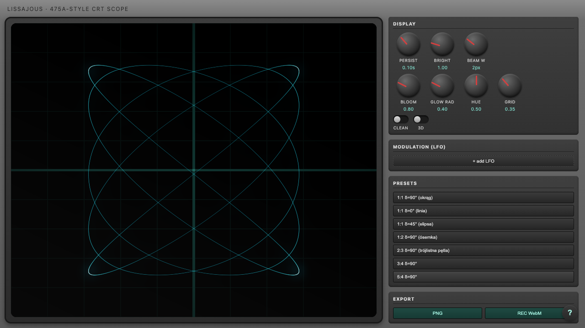

# Lissajous

Symulator oscyloskopu CRT w trybie XY, rysujący krzywe Lissajous — zbudowany
jako hołd dla laboratoryjnych ćwiczeń ze strojenia analogowych oscyloskopów
(referencja wizualna: Tektronix 475A).



To nie jest wykres funkcji. Wiązka jest symulowana fizycznie: jasność w danym
punkcie jest odwrotnie proporcjonalna do prędkości wiązki (wolniej = jaśniej,
dokładnie jak w prawdziwej lampie), obraz ma poświatę fosforu (persistence)
zanikającą wykładniczo w czasie oraz bloom.

## Stack

- Vite + React + TypeScript
- three.js — własny, wielopasmowy renderer (bez `@react-three/fiber`):
  wiązka jako instancjonowane segmenty w shaderze, ping-pong persistence,
  bloom (separable gaussian), kompozyt z rampą fosforu i siatką
- zustand — stan aplikacji
- vitest — testy rdzenia sygnałowego

## Uruchomienie

Wymaga Node ≥20.19 lub ≥22.12 (patrz `.nvmrc`).

```bash
npm install
npm run dev
```

Inne komendy:

```bash
npm run build   # build produkcyjny
npm run test    # vitest
npm run lint    # oxlint
```

## Jak to działa

- **CH1 / CH2** — dwa generatory (X i Y): kształt fali (sinus/trójkąt/
  kwadrat/piła), częstotliwość, amplituda, faza, offset DC, zanik obwiedni.
  Stosunek częstotliwości CH1:CH2 i różnica faz (δ) między nimi decydują
  o kształcie krzywej.
- **Display** — Persist (długość smugi), Bright, Beam Width, Bloom/Glow Rad
  (poświata), Hue (kolor fosforu), Grid, Clean (wyłącza siatkę/winietę),
  3D (dokłada kanał Z i obrót widoku myszką).
- **Modulation (LFO)** — modulatory nakładane na dowolny parametr dowolnego
  kanału (np. wolno pływająca częstotliwość).
- **Presets** — gotowe klasyczne stosunki (1:1, 1:2, 2:3, 3:4, 5:4).
- **Export** — PNG (też skrót Cmd/Ctrl+S) i nagrywanie WebM.
- Stan aplikacji jest kodowany w URL (`#s=...`) — link można wysłać dalej.
- Gałki: przeciągnij pionowo, scroll, strzałki, dwuklik = reset do wartości
  domyślnej, Shift = tryb precyzyjny.

Przycisk **?** w prawym dolnym rogu otwiera interaktywny samouczek
przechodzący po kolejnych sekcjach panelu.
